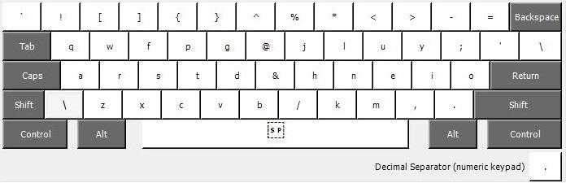
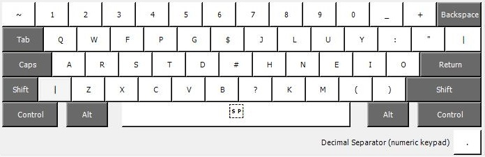
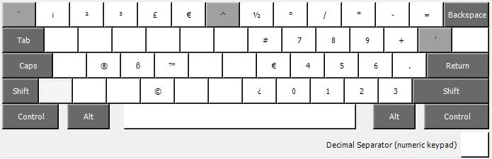

# keyboard

Some custom keyboards I use.

## Wide Programmers Colemak
A [wide version](https://forum.colemak.com/topic/839-colemak-extrawide-layout-alternate-home-position/) of [Colemak](https://colemak.com/), where the numbers are lifted to the Shift state, getting the special characters down to the normal state. The special characters are shuffled around to more easily type some F# related glyphs, e.g. -> and |>.

Shift state:

AltGr state:
